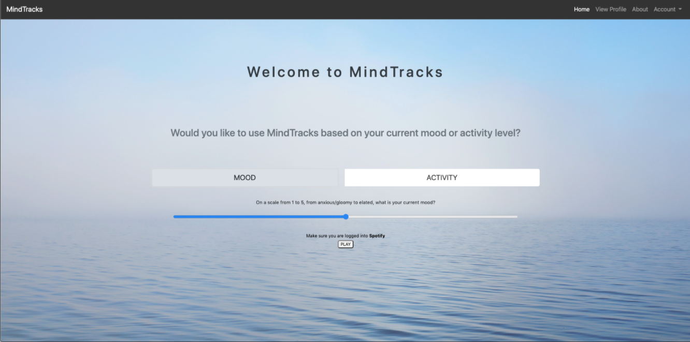

# MindTracks

## About
- MindTracks is a web app which provides users with a categorized playlist to support their well-being.  
- The user can register and login to listen to a generated playlist based on current state of mood and activity level.  
- Spotify Widgets are populated in an embedded view for the user to listen to.  

## Looking Forward
- Improve 'View Profile' page to include saved playlists.  
- Utilize the Spotify API to the full extent to let user login without opening a new page, and offer more variety of playlists.  

## Notes
- This app was developed by Alex Shin, Jessica Dutton, Dustin Walkup, and Chunho Lee during BeaverHacks, a three-day hackathon hosted by the OSU Hackathon Club at Oregon State University. The event took place September 10 - 13, and the team competed in the New Student Category with the theme "Health".
